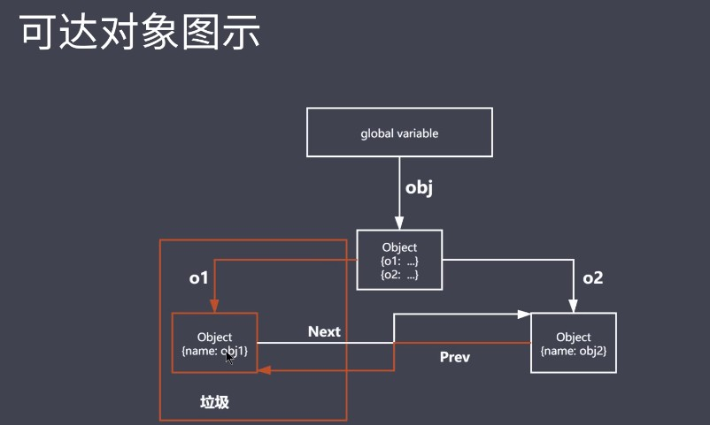

### javascript中的垃圾回收
* javascript中内存管理是自动的；创建对象、数组、函数时会自动分配相应的内存空间，
* 对象不再被引用时是垃圾；后续程序执行过程中，如果通过引用关系无法找到某些对象，那么这些对就会被看做垃圾
* 对象不能从根上访问到时是垃圾

### javascript中的可达对象
* 可以访问到的对象就是可达对象（引用、作用域链）
* 可达的标准就是从根出发是否能够被找到(在一个作用域链上，只要通过根可以有路径查找到的对象都是可达对象)
* javascript中的根就可以理解为是全局变量对象（全局执行上下文）

```javascript
let obj = { name: 'xm' } // 全局、可以从根上找到（可达的）

let ali = obj // 引用数值变化

obj = null // xm对象还是可达的，因为ali还引用着xm对象空间
```

```javascript
function objGroup(obj1, obj2) {
    obj1.next = obj2
    obj2.prev = obj1
    return {
        o1: obj1,
        o2: obj2,
    }
}

let obj = objGroup({ name: 'obj1' }, { name: 'obj2' })
```



如果查找obj1的路线都删除，那么就查找不到obj1了，obj1就会被看做垃圾
