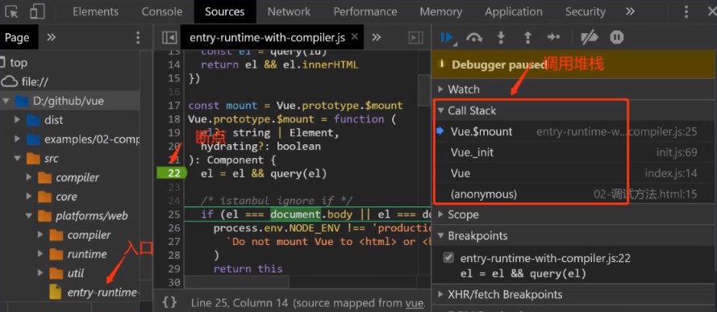

# 一、Vue.js 源码剖析-响应式原理

### Vue的不同构建版本
* **完整版**：同时包含**编译器**和**运行时**的版本
* **编译器**：用来将模板字符串编译成为 javascript 渲染函数的代码，体积大、效率低
* **运行时**：用来车间 Vue 实例、渲染并处理虚拟 DOM 等代码，体积小、效率高。基本上就是除去编译器的代码
* **UMD**：UMD 版本**通用的模块版本**，支持多种模块方式。vue.js 默认文件就是运行时 + 编译器的 UMD 版本
* **Commonjs(cjs)**：Commonjs 版本用来配合老的打包工具比如 Browserify 或 webpack 1
* **ES Module**：从2.6开始 Vue会提供两个 ES Module(ESM)构建文件，为现代打包工具提供的版本
    * ESM 该是被设计为可以可以被静态分析，所以打包工具可以利用这一点来进行‘tree-shaking’并将用不到的代码排除出最终的包

### 寻找入口文件
* 执行构建
```
npm run dev
# "dev": "rollup -w -c scripts/config.js --sourcemap --environment TARGET:web-full-dev"
# --environment TARGET:web-full-dev 设置环境变量 TARGET
```
* script/config.js 的执行过程
    * 作用：生成 rollup 构建的配置文件
    * 使用环境变量 TARGET = web-full-dev
```javascript
// 判断环境变量是否有 TARGET
// 如果有的话，使用 genConfig() 生成 rollup 配置文件
if (process.env.TARGET) {
  module.exports = genConfig(process.env.TARGET)
} else {
  // 否则获取全部配置
  exports.getBuild = genConfig
  exports.getAllBuilds = () => Object.keys(builds).map(genConfig)
}

```

### 从入口开始
* src/platform/web/entry-runtime-with-compiler.js

通过查看源码解决下面问题
* 观察以下代码，通过阅读源码，回答页面上输出的结果
```javascript
const vm = new Vue({
  el: '#app',
  template: '<h3>Hello template</h3>',
  render (h) {
    return h('h4', 'Hello render')
  }
})
```
阅读源码记录
* el不能是 body 或者 html 标签
* 如果没有 render 方法，把 template 转换成 render 函数
* 如果后 render方法，直接调用 mount 挂载 DOM
```javascript
// 1. el 不能是 body 或者 html
if (el === document.body || el === document.documentElement) {
  process.env.NODE_ENV !== 'production' && warn(
    `Do not mount Vue to <html> or <body> - mount to normal elements instead.`
  )
  return this
}
const options = this.$options
if (!options.render) {
  // 2. 把 template/el 转换成 render 函数
  // ...
}
// 3. 调用 mount 方法，挂载 DOM
return mount.call(this, el, hydrating)
```
* 调试代码
    * 调试的方法
```javascript
const vm = new Vue({
  el: '#app',
  template: '<h1>Hello Template</h1>',
  render(h) {
  return h('h1', 'Hello Render')
 }
})
```


> Vue 的构造函数在哪？
>
> Vue 实例的成员、Vue 的静态成员从哪里来的？

### Vue初始化的过程
四个导出 Vue 的模块
* src/platforms/web/entry-runtime-with-compiler.js
    * web 平台相关的入口
    * 重写了平台相关的 $mount() 方法
    * 注册了 Vue.compile() 方法，传递一个 HTML 字符串返回 render 函数
* src/platforms/web/runtime/index.js
    * web 平台相关
    * 注册和平台相关的全局指令：v-model、v-show
    * 注册和平台相关的全局组件：v-transition、v-transition-group
    * 全局方法：
        * __patch__：把虚拟 DOM 转换成真实 DOM
        * $mount：挂载方法
* src/core/index.js
    * 与平台无关
    * 设置了 Vue 的静态方法，initGlobalAPI(Vue)
* src/core/instance/index.js
    * 与平台无关
    * 定义了构造函数，调用了 this._init(options)方法
    * 给 Vue 中混入了常用的实例成员
