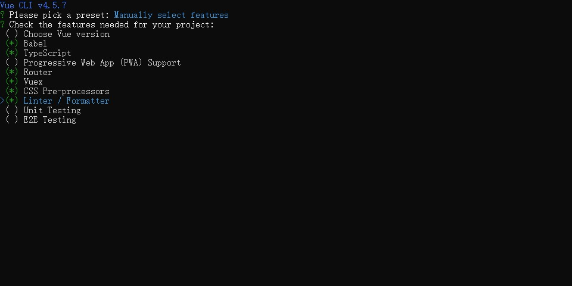
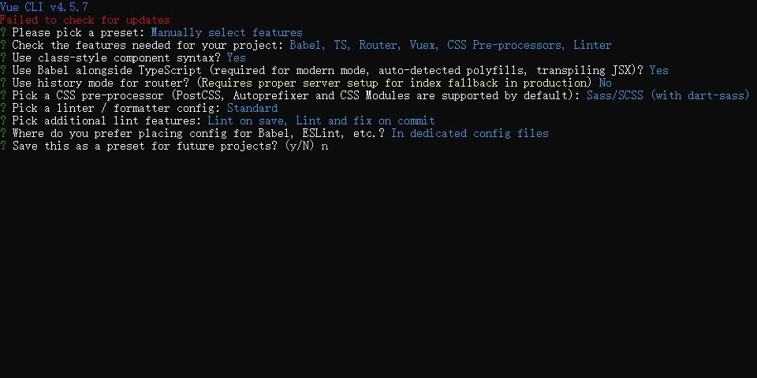
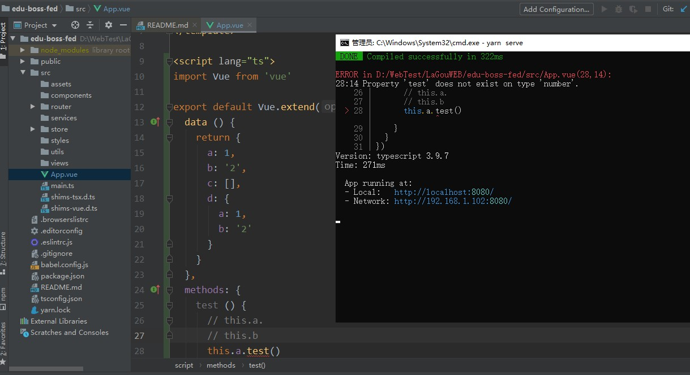
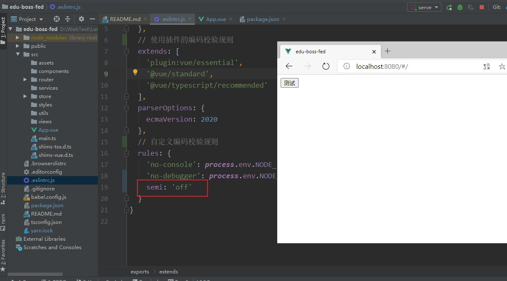
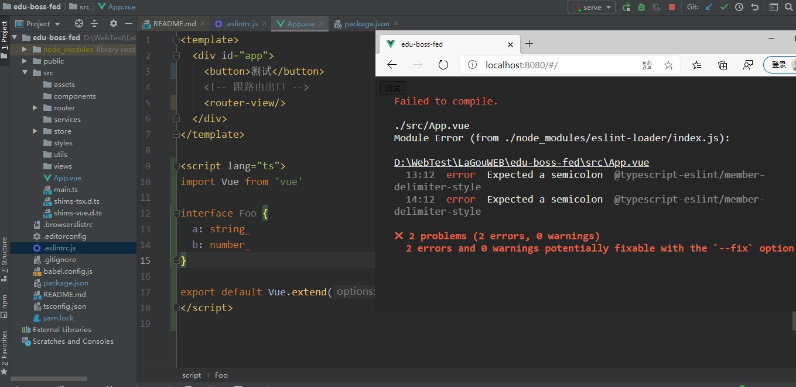

# Vue.js + TypeScript 实战项目开发与项目优化

## 一、搭建项目架构
### 一、使用VueCli创建项目
```base
vue create edu-boss-fed
```




```base
cd edu-boss-fed
yarn serve
```

### 二、加入Git版本管理
创建一个空的GitHub仓库，将本地项目同步到GitHub上
```base
git init
git add README.md
git commit -m "first commit"
git branch -M main
git remote add origin https://github.com/YuYun95/edu-boss-fed.git
git push -u origin main
```

### 三、初始目录结构说明
main.ts 入口文件

App.vue 项目根组件

shims-tsx.d.ts 和 shims-vue.d.ts TypeScript配置文件

view/Home.vue 首页组件

view/About.vue about页面组件

store/index.ts 容器模块

router/index.ts 路由模块，配置了路由表

components文件夹，放公共组件

assets文件夹，存放静态资源

public文件夹，纯静态资源，不会被打包，可以直接 '/文件名'访问

.browserslistrc 浏览器兼容配置

.editorconfig 编辑器配置

.eslintrc.js ESLint的配置

.gitignore Git忽略文件

babel.config.js Babel配置文件

package.json 依赖清单

package-lock.json 第三方包具体版本号，确保协同开发时版本一致

tsconfig.json TS相关配置文件

### 四、调整初始目录结构
1. 删除默认示例文件

    * App.vue 删除样式、路由连接，不删除vue-router组件
    * router/index.ts 清空路由表数组
    * 删除views文件夹里的Home.vue和About.vue，删除components文件里的HelloWorld.vue，删除assets里的logo.png

2. 新增一些文件或目录

    * 在src里面创建一个utils（放工具函数）、styles（放全局样式）、services（放请求接口）

### 五、Typescript配置
1. Typescript 相关的依赖项
    * vue-class-component 提供使用Class语法写Vue组件
    * vue-property-decorator 在Class语法基础上提供了一些辅助装饰器
    * @typescript-eslint/eslint-plugin 使用ESLint校验Typescript代码
    * @typescript-eslint/parser 将Typescript转为AST提供ESLint校验使用
    * @vue/cli-plugin-typescript 使用TS + ts-loader-fork-ts-checker-webpack-plugin进行更快的类型检查
    * @vue/eslint-config-typescript 兼容ESLint的TS校验规则
    * typescript TS编译器，提供类型校验和转换JavaScript功能

2. Typescript配置文件tsconfig.json
    ```base
    {
        "compilerOptions": {
            "target": "esnext",
            "module": "esnext",
            "strict": true,
            "jsx": "preserve",
            "importHelpers": true,
            "moduleResolution": "node",
            "experimentalDecorators": true,
            "skipLibCheck": true,
            "esModuleInterop": true,
            "allowSyntheticDefaultImports": true,
            "sourceMap": true,
            "baseUrl": ".",
            "types": [
            "webpack-env"
            ],
            "paths": {
                "@/*": [
                    "src/*"
                ]
            },
            "lib": [
                "esnext",
                "dom",
                "dom.iterable",
                "scripthost"
            ]
        },
        "include": [
            "src/**/*.ts",
            "src/**/*.tsx",
            "src/**/*.vue",
            "tests/**/*.ts",
            "tests/**/*.tsx"
        ],
        "exclude": [
            "node_modules"
        ]
    }
    ```

3. shims-vue.d.ts 文件的作用
    ```base
    // 主要用于 Typescript 识别 .vue 文件模块
    // Typescript 默认不支持导入 .vue 模块，这个文件告诉 Typescript 导入 .vue 文件模块都按VueConstructor<vue> 类型识别处理
    declare module '*.vue' {
        import vue from 'vue'
        export default vue
    }
    ```

4. shims-tsx.d.ts 文件的作用
    ```base
    // 为jsx组件模块补充类型声明
    import vue, { VNode } from 'vue'
    declare global {
        namespace JSX {
            // tslint:disable no-empty-interface
            interface Element extends VNode {}
            // tslint:disable no-empty-interface
            interface ElementClass extends Vue {}
            interface IntrinsicElements {
                [elem: string]: any;
            }
        }
    }
    ```

5. Typescript 模块都使用 .ts 后缀

### 六、使用ts开发项目
1. 使用 Options APIs
    ```base
   <script>
   // 1.编译器给的类型提示
   // 2.typescript编译期间的类型验证
   export default {
     data() {
       return {
         a: 1,
         b: "2",
         c: [],
         d: {
           a: 1,
           b: "2"
         }
       }
     },
     methods: {
       test(){
         // this.a.
         // this.b
         // this.a.test()
       }
     }
   }
   </script>
    ```
    指定script标签的lang属性为ts，则控制台会有ts类型推断检测

    
    
    Typescript在编译阶段就可以知道代码是错误的
    
    在打包项目时，如果有错误typescript编译不通过，打包不成功

2. 使用ClassAPIs定义Vue组件

    使用教程：https://class-component.vuejs.org/
    ```base
    <template>
      <div id="app">
        <h1>拉勾教育</h1>
        <p>{{ a }}</p>
        <button @click="test">测试</button>
        <!-- 跟路由出口 -->
        <router-view/>
      </div>
    </template>
    
    <script lang="ts">
    import Vue from 'vue'
    import Component from 'vue-class-component'
    
    @Component
    
    export default class App extends Vue {
      a = 1
      b = '2'
      c = {
        a: 1,
        b: '2'
      }
    
      test () {
        console.log(this.a)
      }
    }
    </script>
    ```

3. 装饰器语法
    
    装饰器是ES草案的一个新特性，不过这个草案最近有可能发生重大调整，所以不建议在生产环境中使用。
    
    类的装饰器：
    ```base
    function testable (target) {
      target.isTestable = true
    }
   
    @testable
    class MyTableClass {
      // ...
    }
    // 写了上面的两行代码后，会自动的调用testable函数，然后把类传递给函数
    // 装饰器就是扩展类的属性
   
    console.log(MyTestableClass.isTestable) // true
    ```
   
4. 使用vue-property-decorator创建Vue组件

    是在vue-class-component基础上封装的
    
    装饰器语法不稳定

5. 总结创建组件的方式
    * Options APIs
    * Class APIs
    * Class + decorator
    
    个人建议：No Class APIs，只用Options APIs
    > Class语法仅仅是一种写法而已，最终还是要转换为普通的组件数据结构。

    > 装饰器语法还没有正式定稿发布，建议了解即可，正式发布以后再选择使用也可以
    
    使用Options APIs最好是使用`export default Vue.extend({...})`而不是 `export default {...}`
    
### 七、代码规范
1. 标准是什么
   * https://standardjs.com/ Standard Style 宽松一点，适合个人或小团队
   * https://github.com/airbnb/javascript Airbnb 更严格，适合大型团队
   * http://google.github.io/ google 更严格，适合大型团队

2. 如何约束代码规范
    
   只靠口头约定肯定不行，所以要利用工具来强制执行
   * JSLint（不推荐，快被淘汰了）
   * JSHint（不推荐，快被淘汰了）
   * ESLint（主流）
   
   .eslintrc.js
   ```base
   module.exports = {
     root: true,
     env: {
       node: true
     },
     // 使用插件的编码校验规则
     extends: [
       'plugin:vue/essential',
       '@vue/standard',
       '@vue/typescript/recommended'
     ],
     parserOptions: {
       ecmaVersion: 2020
     },
     // 自定义编码校验规则
     rules: {
       'no-console': process.env.NODE_ENV === 'production' ? 'warn' : 'off',
       'no-debugger': process.env.NODE_ENV === 'production' ? 'warn' : 'off'
     }
   }
   ```

3. 自定义校验规则
   
   ESLint官网：https://cn.eslint.org/
   
   Error级别的警告会显示到页面上，Warning级别的警告会输出到控制台

   
   
   如果想屏蔽掉这个规则，则去.eslintrc.js文件中配置,在rules数组里配置了'semi': 'off'，然后重启服务，这个报错就没有了
   
   

   如果必须要有分号，则配置为semi: ['error', 'always']
   
   然后删除node_modules/.cache文件，再重启项目，就可以看到效果了，报错缺少分号

   Typescript 的 interface会要有分号分割要求，为了与standard分割保持一致，我们期望去掉这个规则
   
   

   从package.json里找到@vue/eslint-config-typescript依赖的地址：https://github.com/vuejs/eslint-config-typescript#readme
   
   然后在[这里](https://github.com/typescript-eslint/typescript-eslint/tree/master/packages/eslint-plugin)查到这个规则，在[规则详细配置](https://github.com/typescript-eslint/typescript-eslint/blob/master/packages/eslint-plugin/docs/rules/member-delimiter-style.md)查看怎么配置，在.eslintrc.js里增加规则：
   ```base
   '@typescript-eslint/member-delimiter-style': ['error', {
     "multiline": {
       "delimiter": "none",
       "requireLast": true
     }
   }]
   ```
   然后重启项目，interface里面不写分号分割也不报错了，如果写上分号反而会报错

### 八、引入ElementUI组件库
ElementUI官方文档：https://element.eleme.cn/
```base
npm i element-ui -S
```
main.js中增加ElementUI的导入和使用：
```base
import Vue from 'vue'
import ElementUI from 'element-ui'
import 'element-ui/lib/theme-chalk/index.css'
import App from './App.vue'
import router from './router'
import store from './store'

Vue.use(ElementUI)

Vue.config.productionTip = false

new Vue({
  router,
  store,
  render: h => h(App)
}).$mount('#app')
```

### 九、样式处理
```base
src/styles
|-- index.scss # 全局样式（在入口模块被加载生效）
|-- mixin.scss # 公共的 mixin 混入（可以把重复的样式封装为 mixin 混入到复用的地方）
|-- reset.scss # 重置基础样式
|-- variables.scss # 公共样式变量
```
elementUI的样式就不需要导入了，改为导入全局样式文件

main.js
```base
import Vue from 'vue'
import ElementUI from 'element-ui'
// import 'element-ui/lib/theme-chalk/index.css'
import App from './App.vue'
import router from './router'
import store from './store'

// 加载全局样式
import './styles/index.scss'

Vue.use(ElementUI)

Vue.config.productionTip = false

new Vue({
  router,
  store,
  render: h => h(App)
}).$mount('#app')
```

### 十、共享全局样式变量
[向预处理器 Loader 传递选项](https://cli.vuejs.org/zh/guide/css.html#%E5%90%91%E9%A2%84%E5%A4%84%E7%90%86%E5%99%A8-loader-%E4%BC%A0%E9%80%92%E9%80%89%E9%A1%B9)
```base
// vue.config.js
module.exports = {
  css: {
    loaderOptions: {
      // 默认情况下 `sass` 选项会同时对 `sass` 和 `scss` 语法同时生效
      // 因为 `scss` 语法在内部也是由 sass-loader 处理的
      // 但是在配置 `prependData` 选项的时候
      // `scss` 语法会要求语句结尾必须有分号，`sass` 则要求必须没有分号
      // 在这种情况下，我们可以使用 `scss` 选项，对 `scss` 语法进行单独配置
      scss: {
        prependData: `@import "~@/styles/variables.scss";` // css 里要加~符号才能使用@目录
      }
    }
  }
}
```
然后就可以在任意组件中使用全局样式变量了；如果没有配置，那么如果想用全局样式变量要在相应的文件引入样式文件

App.vue
```base
<template>
  <div id="app">
    <!-- 跟路由出口 -->
    <router-view/>

    <p class="text">hell</p>
  </div>
</template>

<script lang="ts">
import Vue from 'vue'

export default Vue.extend({})
</script>

<style lang="scss">
.text{
  color: $success-color;
}
</style>

```


