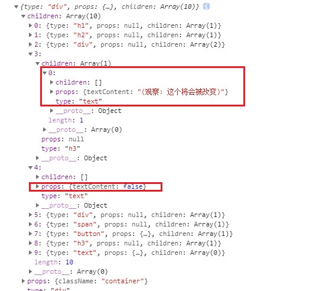

## VirtualDOM 及 Diff 算法
### 1. JSX到底是什么
使用React就一定会写JSX，JSX到底是什么呢？他是一种javascript语法扩展，React使用它来描述用户界面长什么样子，虽然他看起来非常像HTML，但他确实是javascript。在React代码执行之前，Babel会将JSX编译为React API
```react
<div className="container">
    <h3>Hello React</h3>
    <p>React is great</p>
</div>
```
```js
React.createElement(
    'div',
    {
        className: 'container'
    },
    React.createElement('h3', null, 'Hello React'),
    React.createElement('p', null, 'React is great')
)
```
从两种语法对比来看，JSX语法的出现是为了让React开发人员编写用户界面代码更加轻松
[Babel REPL](https://babeljs.io/repl)

### 2. DOM操作问题
在现代web应用程序中使用javascript操作DOM是必不可少的，但遗憾的是他比其他大多数javascript操作要慢的多。

大多数javascript框架对应DOM的更新远远超过其必须进行的更新，从而使得这种缓慢操作变得更糟

例如假设你有包含是个项目的列表，你仅仅更改了列表中的第一项，大多数javascript框架会重建整个列表，这比必要的工作要多十倍。

更新效率低下宜家成为严重问题，为了解决这个问题，React普及了一种Virtual DOM的东西

### 3. 什么是 Virtual DOM
Virtual DOM出现的目的就是为了提高javascript操作DOM对象的效率

在React中，每个DOM对象都有一个对应的Virtual DOM对象，他是DOM对象的javascript对象表现形式，其实就是使用javascript对象来描述DOM对象信息，比如DOM对象的类型是什么，他身上有哪些属性，它拥有哪些子元素

可以把Virtual DOM对象理解为DOM对象的副本，但是他不能直接显示在屏幕上
```html
<div className="container">
  <h3>Hello React</h3>
  <p>React is great</p>
</div>
```
```js
{
  type: 'div',
  props: { className: 'container' },
  children: [
    {
      type: 'h3',
      props: null,
      children:[
        {
          type: 'text',
          props: { textContent: 'Hello React' }
        }
      ]
    },
    {
      type: 'p',
      props: 'null',
      children: [
        {
          type: 'text',
          props: { textContent: 'React is great' }
        }
      ]
    }
  ]
}
```

### 4. Virtual DOM 如何提升效率
精准找出发生改变的DOM对象，只更新发生变化的部分

在React第一次创建DOM对象后，会为每个DOM对象创建其对应的Virtual DOM对象，在DOM对象发生变化更新之前，React会先更新所有的Virtual DOM对象，然后React会将更新后的Virtual DOM和更新前的Virtual DOM进行比较，从而找出发生变化的部分，React会将发生变化的部分更新到真实DOM对象中，React仅更新必要更新的部分

Virtual DOM对象的更新和比较仅发生在内存中，不会在视图中渲染任何内容，所以这一部分的性能损耗成本是微不足道的。


```html
<div id="container">
	<p>Hello React</p>
</div>
```
```html
<div id="container">
	<p>Hello Angular</p>
</div>
```
```js
const before = {
  type: "div",
  props: { id: "container" },
  children: [
    {
      type: "p",
      props: null,
      children: [
        { type: "text", props: { textContent: "Hello React" } }
      ]
    }
  ]
}
```
```js
const after = {
  type: "div",
  props: { id: "container" },
  children: [
    {
      type: "p",
      props: null,
      children: [
        { type: "text", props: { textContent: "Hello Angular" } }
      ]
    }
  ]
}
```

### 5. 创建 Virtual DOM
在React代码执行前，JSX不被Babel转为React.createElement方法的调用，在调用从reactElement方法时会传入元素的类型，元素的属性，以及元素的子元素，createElement方法的返回值为构建好的Virtual DOM 对象
```js
{
  type: "div",
  props: null,
  children: [{type: "text", props: {textContent: "Hello"}}]
}
```
```js
/**
 * 创建 Virtual DOM
 * @param {string} type 类型
 * @param {object | null} props 属性
 * @param  {createElement[]} children 子元素
 * @return {object} Virtual DOM
 */
function createElement (type, props, ...children) {
	return {
    type,
    props,
    children
  } 
}
```
从createElement方法的第三个参数开始就都是子元素了，在定义createElement方法时，通过...children将所有的子元素放置到children数组中。
```js
const virtualDOM = (
  <div className="container">
    <h1>你好 Tiny React</h1>
    <h2>(编码必杀技)</h2>
    <div>
      嵌套1 <div>嵌套 1.1</div>
    </div>
    <h3>(观察: 这个将会被改变)</h3>
    {2 == 1 && <div>如果2和1相等渲染当前内容</div>}
    {2 == 2 && <div>2</div>}
    <span>这是一段内容</span>
    <button onClick={() => alert("你好")}>点击我</button>
    <h3>这个将会被删除</h3>
    2, 3
  </div>
)
console.log(virtualDOM)
```
通过以上代码测试，发现返回的 Virtual DOM 存在一些问题，第一个问题是文本节点被直接放入到了数组中


而我们期望是文本节点应该是这样的

```js
children: [
  {
    type: "text",
    props: {
      textContent: "React is great"
    }
  }
]
```
通过以下代码对 Virtual DOM 进行改造，重新构建 Virtual DOM。
```js
// 将原有 children 拷贝一份 不要在原有数组上进行操作
const childElements = [].concat(...children).map(child => {
  // 判断 child 是否是对象类型
  if (child instanceof Object) {
    // 如果是 什么都不需要做 直接返回即可
    return child
  } else {
    // 如果不是对象就是文本 手动调用 createElement 方法将文本转换为 Virtual DOM
    return createElement("text", { textContent: child })
  }
})
return {
  type,
  props,
  children: childElements
}
```



通过观察返回的 Virtual DOM，文本节点已经被转化成了对象类型的 Virtual DOM，但是布尔值也被当做文本节点被转化了，在 JSX 中，如果 Virtual DOM 被转化为了布尔值或者null，是不应该被更新到真实 DOM 中的，所以接下来要做的事情就是清除 Virtual DOM 中的布尔值和null。
```js
// 由于 map 方法无法从数据中刨除元素, 所以此处将 map 方法更改为 reduce 方法
const childElements = [].concat(...children).reduce((result, child) => {
  // 判断子元素类型 刨除 null true false
  if (child != null && child != false && child != true) {
    if (child instanceof Object) {
      result.push(child)
    } else {
      result.push(createElement("text", { textContent: child }))
    }
  }
  // 将需要保留的 Virtual DOM 放入 result 数组
  return result
}, [])
```

在 React 组件中，可以通过 props.children 获取子元素，所以还需要将子元素存储在 props 对象中。
```js
return {
  type,
  props: Object.assign({ children: childElements }, props),
  children: childElements
}
```


