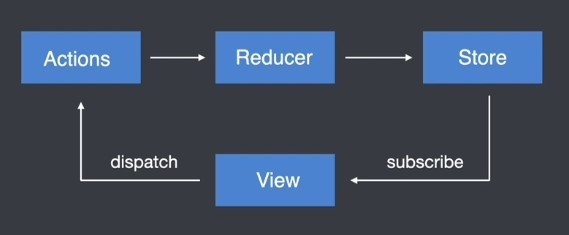

## React 状态管理工具
### Redux
#### 1.Redux 核心
##### 1.1 Redux 介绍
javascript状态容器，提供可预测化的状态管理
```js
const state = {
  modelOpen: 'yes',
  btnClicked: 'no',
  btnActiveClass: 'active',
  page: 5,
  size: 10
}
```
##### 1.2 Redux 核心概念及工作流程
* Store：存储状态的容器，javascript对象
* View：视图，HTML页面
* Actions：对象，描述对状态进行怎样的操作
* Reducers：函数，操作状态并返回新的状态



#### 1.3 Redux使用：计数器案例
```html
<!DOCTYPE html>
<html lang="en">
<head>
  <meta charset="UTF-8">
  <meta http-equiv="X-UA-Compatible" content="IE=edge">
  <meta name="viewport" content="width=device-width, initial-scale=1.0">
  <title>Document</title>
</head>
<body>
<button id="plus">+</button>
<span id="count">0</span>
<button id="minus">-</button>

  <script src="./redux.min.js"></script>
  <script>
    // 3. 存储默认状态
    var initialState = {
      count: 0
    }
    
    /**
     * 2. 创建reducer函数
     * 第一次进入页面时会触发一次action，就是存储默认的state
     * @param state  是createStore传的第二个参数，有传递就用，没传递就用初始化的值,一般不会createStore这么传递
     * @param action 是dispatch时的参数
     */
    function reducer(state = initialState, action) {
      switch(action.type) {
        case 'increment':
          return { count: state.count + 1 }
        case 'decrement':
          return { count: state.count - 1 }
        default:
          return state
      }
    }

    // 1.创建store对象，返回是store存储状态
    var store = Redux.createStore(reducer)

    // 4. 定义action
    var increment = { type: 'increment' }
    var decrement = { type: 'decrement' }

    // 5. 获取按钮给按钮添加点击事件
    document.getElementById('plus').onclick = function() {
      // 6. 触发action
      store.dispatch(increment)
    }

    document.getElementById('minus').onclick = function() {
      // 6. 触发action
      store.dispatch(decrement)
    }

    // 7.同步视图 订阅store，store的状态发生变化时就执行
    store.subscribe(() => {
      // 获取store对象中存储的状态
      //console.log(store.getState())
      document.getElementById('count').innerHTML = store.getState().count
    })


    
  </script>
</body>
</html>
```

##### 1.4 Redux 核心
```js
// 创建 Store 状态容器
const store = Redux.createStore(reducer)

// 创建用于处理状态的 reducer 函数
function reducer(state = initialState, action) {}

// 获取状态
store.getState()

// 订阅状态
store.subscribe(function() {})

// 触发 Action
store.dispatch({ type: 'description...'})
```

#### 2. React + Redux
##### 2.1 在React中不使用Redux时遇到的问题
在React中组件通信的数据流是单向的，顶层组件可以通过props属性向下层组件传递数据，而下层组件不能向上层组件传递数据，要实现下层组件修改数据，需要上层组件传递修改数据的方法到下层组件，当项目越来越大的时候，组件之间传递数据变得越来越困难。

##### 2.2 在React项目中加入Redux的好处
使用Redux管理数据，由于Store独立于组件，使得数据管理独立于组件，解决了组件之间传递数据困难的问题。

##### 2.3 下载 Redux
```base
npm install redux react-redux
```

##### 2.4 Redux工作流程
1. 组件通过 dispatch 方法触发 Action
2. Store 接收 Action 并将 Action 分发给 Redux
3. Reducer 根据 Action 类型对状态进行更改并将更改后的状态返回给Store
4. 组件订阅了Store中的状态，Store中的状态更新会同步到组件


